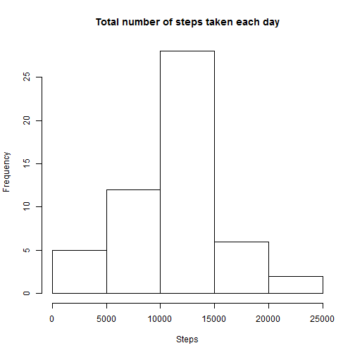
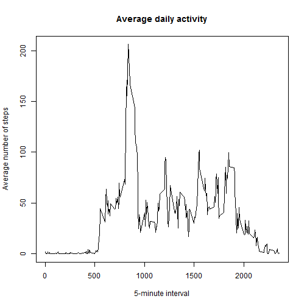
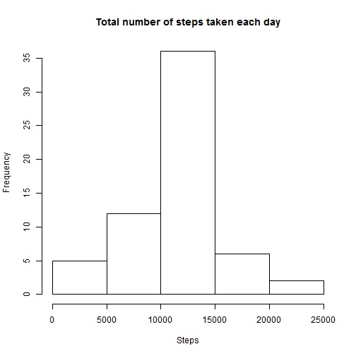
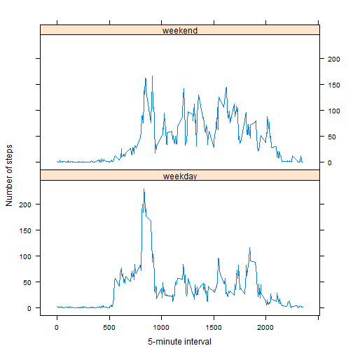

# Reproducible Research: Peer Assessment 1


## Loading and preprocessing the data

```r
activity <- read.csv("activity.csv")
activity2 <- activity[!is.na(activity$steps), ]
DailySteps <- aggregate(steps ~ date, data = activity2, sum)
```


## What is mean total number of steps taken per day?
1.Make a histogram of the total number of steps taken each day


```r
hist(DailySteps$steps, xlab = "Steps", main = "Total number of steps taken each day")
```

 


2.Calculate and report the mean and median total number of steps taken per day


```r
mean(DailySteps$steps)
```

```
## [1] 10766
```


The **mean** total number of steps taken per day is 10766 steps.


```r

median(DailySteps$steps)
```

```
## [1] 10765
```


The **median** total number of steps taken per day is 
    10765 steps.

## What is the average daily activity pattern?

1.Make a time series plot (i.e. type = "l") of the 5-minute interval (x-axis) and the average number of steps taken, averaged across all days (y-axis)


```r

FiveMinute <- aggregate(steps ~ interval, data = activity2, mean)
plot(steps ~ interval, data = FiveMinute, type = "l", xlab = "5-minute interval", 
    ylab = "Average number of steps", main = "Average daily activity")
```

 


2.Which 5-minute interval, on average across all the days in the dataset, contains the maximum number of steps?


```r
FiveMinute[which.max(FiveMinute$steps), ]$interval
```

```
## [1] 835
```


The **835th** interval.

## Imputing missing values

1.Calculate and report the total number of missing values in the dataset (i.e. the total number of rows with NAs)


```r
sum(is.na(activity$steps))
```

```
## [1] 2304
```


2304 rows are missing.


2.Devise a strategy for filling in all of the missing values in the dataset. The strategy does not need to be sophisticated. For example, you could use the mean/median for that day, or the mean for that 5-minute interval, etc.

Rule : "filling by the mean for that 5-minute interval"

```r
s <- split(activity$steps, activity$interval)
s2 <- lapply(s, function(x) {
    x <- ifelse(is.na(x), mean(x, na.rm = TRUE), x)
})
```


3.Create a new dataset that is equal to the original dataset but with the missing data filled in.


```r
activity_imputed <- activity
activity_imputed$steps <- unsplit(s2, activity$interval)
```


4.Make a histogram of the total number of steps taken each day and Calculate and report the mean and median total number of steps taken per day. Do these values differ from the estimates from the first part of the assignment? What is the impact of imputing missing data on the estimates of the total daily number of steps?


```r
DailySteps_imputed <- aggregate(steps ~ date, data = activity_imputed, sum)
hist(DailySteps_imputed$steps, xlab = "Steps", main = "Total number of steps taken each day")
```

 

```r
mean(DailySteps_imputed$steps)
```

```
## [1] 10766
```

```r
median(DailySteps_imputed$steps)
```

```
## [1] 10766
```

The **mean** total number of steps taken per day is 10766 steps.

The **median** total number of steps taken per day is 
    10766 steps.

The **mean** value is the **same**. The **median** value differs in one. 

In this case, The impact of the rule "filling by the mean for that 5-minute interval" is minimum.

## Are there differences in activity patterns between weekdays and weekends?

For this part the **weekdays()** function may be of some help here. Use the dataset with the filled-in missing values for this part.

1.Create a new factor variable in the dataset with two levels - "weekday" and "weekend" indicating whether a given date is a weekday or weekend day.


```r
Sys.setlocale("LC_TIME", "English")
```

```
## [1] "English_United States.1252"
```

```r
activity_imputed$day <- factor(ifelse(weekdays(as.Date(activity_imputed$date)) %in% 
    c("Saturday", "Sunday"), "weekend", "weekday"))
```


2.Make a panel plot containing a time series plot (i.e. type = "l") of the 5-minute interval (x-axis) and the average number of steps taken, averaged across all weekday days or weekend days (y-axis). 


```r
activity_week <- aggregate(steps ~ interval + day, activity_imputed, mean)
library(lattice)
xyplot(steps ~ interval | day, data = activity_week, type = "l", xlab = "5-minute interval", 
    ylab = "Number of steps", layout = c(1, 2))
```

 

